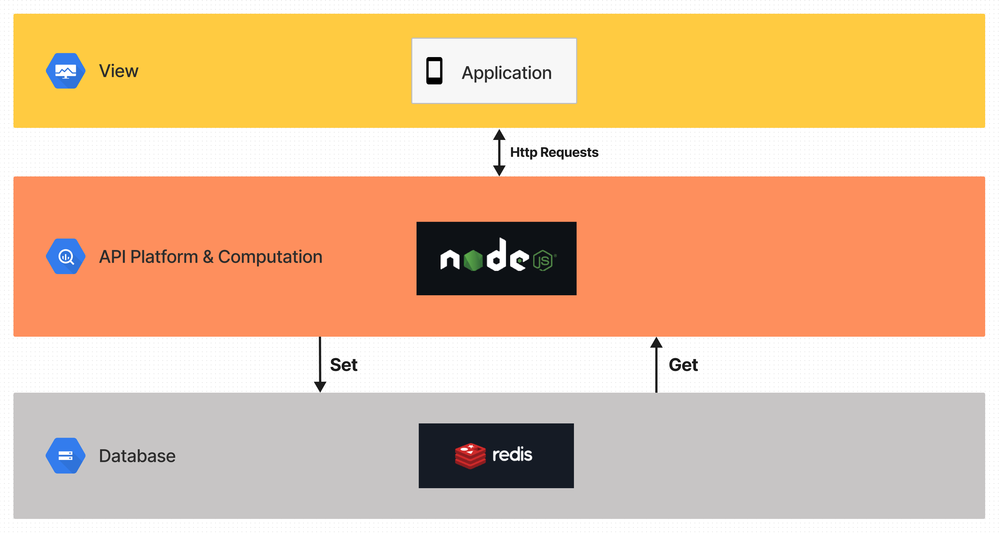

# BackEnd of HKU Tree Hole

## Setup
1. Redis (for data storage)
for macOS:
```
brew install redis
```

Then, run redis on the foreground
```
redis-server
```
Or run on the background
```
// start
brew services start redis
// stop
brew services stop redis
```

for other OS, please refer to: https://redis.io/docs/getting-started/installation/install-redis-on-mac-os/

2. Server (for connection with app client, handle requests, ...)
TODO: npm build / run ...

## Structure Design


## API Document
Host: localhost:8000 (TODO: Deployment on Tencent Cloud Server)
Base Path: /api
Please refer to: https://app.swaggerhub.com/apis-docs/SmartPhoneApp_2022/SmartPhoneAppHKU2022/1.0.0#/
